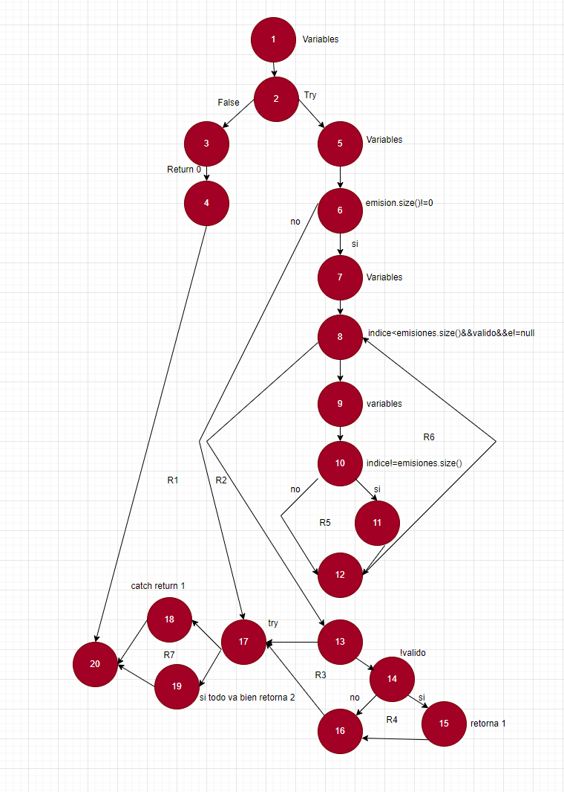

<h1>EJERCICIO DE CAMINO BÁSICO I</h1>

* Grafo de flujo.

.png>)

* Complejidad ciclomática 

1. Aristas =26 Nodos =20 (26-20+2=<b>8</b>)
2. Nodos predicados =7 (7+1=<b>8</b>)
3. Regiones =7 (7+1=<b>8</b>)

* Caminos 

<b>:one: Camino:</b> 1-2-3-4-20
<b>:two: Camino:</b> 1-2-5-6-17-18-20
<b>:three: Camino:</b> 1-2-5-6-17-19-20
<b>:four: Camino: </b>1-2-5-6-7-8-9-10-11-12-8-13-17-18-20
<b>:five: Camino:</b> 1-2-5-6-7-8-9-10-11-12-8-13-17-19-20
<b>:six: Camino:</b>1-2-5-6-7-8-9-10-11-12-8-13-14-15-16-17-18-20
<b>:seven: Camino:</b> 1-2-5-6-7-8-9-10-11-12-8-13-14-15-16-17-19-20
<b>:eight:Camini: </b>1-2-5-6-7-8-9-10-11-12-8-13-14-16-17-18-20
<b>:nine: Camino: </b>1-2-5-6-7-8-9-10-11-12-8-13-14-16-17-19-20
<b>10 Camino: </b>1-2-5-6-7-8-17-18-20
   
* Tabla donde se indique: Camino, caso de prueba y Resultado esperado.

| Caminos | Casos de prueba | Resultado esperado |
|----------|----------|----------|
| 1    | Try devuelve la variable valido. Si valido no es igual a true, entra y devuelve 0.|👉  Devuelve el valor que tiene return =0
| 2    |Si try devuelve true, procederemos a verificar la condicion emision.size()!=0. Si esto no se cumple, pasamos al siguiente try. Si hay errores al incluir emision, esto retornará 1. |👉 Devuelve el valor que tiene return =1
| 3    | Si  try devuelve true, entonces procederemos a verificar  la condicion emision.size()!=0. Si esta condición no se cumple, pasaremos al siguiente try. Si todo ha ido bien, devolveremos  2. |👉Devuelve el valor que tiene return =2 
|  4  |Si if(!valido) no es válido, pasa al siguiente if(emisiones.size()!=0)  si la lista de emisiones no está vacía.Comprueba la condicion del bucle indice<emision.size.() && valido&&e!=null mientras el índice sea menor que el tamaño de la lista de emisiones, y si aún es válido y la emisión en esa posición no es nula. Realiza las tareas correspondientes dentro de este bucle. Al terminar el bucle con el incremento, sale y pasa al try. Si hay algún error durante la ejecución del código dentro del try, se captura en el catch correspondiente y termina la ejecución.   |👉 Devuelve el return 1
|5|Si if(!valido) no se cumple, pasa al siguiente if donde se verifica si if(emisiones.size()!=0). Si esta condición se cumple,  ingresa en el bucle que se ejecuta mientras indice < emision.size() y valido y e != null. Cumple esta condición, se procede a comprobar if(indice != emision.size()), si cumple, realiza las tareas correspondientes.  se pasa a un  try. Si todo el código dentro del bloque try se ejecuta sin errores, se retorna el valor 2.|👉 Devuelve el return 2
|6|Si !valido no se cumple, se pasa al siguiente if donde se verifica si indice != emision.size(). Si esta condición se cumple, se ingresa a un bucle while. Dentro de este bucle, se verifica si indice != emisiones.size(), y si es así, se llevan a cabo las tareas correspondientes. Después de salir del bucle, se comprueba la condición if (!valido) que se encuentra al terminar del bucle. Si esta condición se cumple, se retorna 1.Después de esta verificación, se pasa al try. Si hay errores durante la ejecución del código dentro del try", se ingresa al catch|👉Devuelve un 1
|7|Si !valido no se cumple, se pasa al siguiente if donde se verifica si indice != emision.size(). Si esta condición se cumple, se ingresa a un bucle while. Dentro de este bucle, se verifica si indice != emisiones.size(), y si es así, se llevan a cabo las tareas correspondientes. Después de salir del bucle, se comprueba la condición if (!valido) que se encuentra al terminar del bucle. Si esta condición se cumple, se retorna 1.Después de esta verificación, se pasa al try. Si todo va bien NO entra al catch|👉Devuelve un 2
|8|Si !valido no se cumple, se pasa al siguiente if donde se verifica si indice != emision.size(). Si esta condición se cumple, se ingresa a un bucle while. Dentro de este bucle,se comprueba la condición if (!valido) que se encuentra al terminar del bucle. Si esta condición NO cumple, pasa al try. Si hay errores entra al catch|👉Devuelve un 1
|9|Si !valido no se cumple, se pasa al siguiente if donde se verifica si indice != emision.size(). Si esta condición se cumple, se ingresa a un bucle while. Dentro de este bucle,se comprueba la condición if (!valido) que se encuentra al terminar del bucle. Si esta condición NO cumple, pasa al try. Si NO entra al catch|👉Devuelve un 2
|10|Si !valido no se cumple, se pasa al siguiente if donde se verifica si indice != emision.size(). Si esta condición se cumple, Combprueba el bucle como esto no se cumple, pasa al try , verifica el error y termina el programa|👉Devuelve un 1

