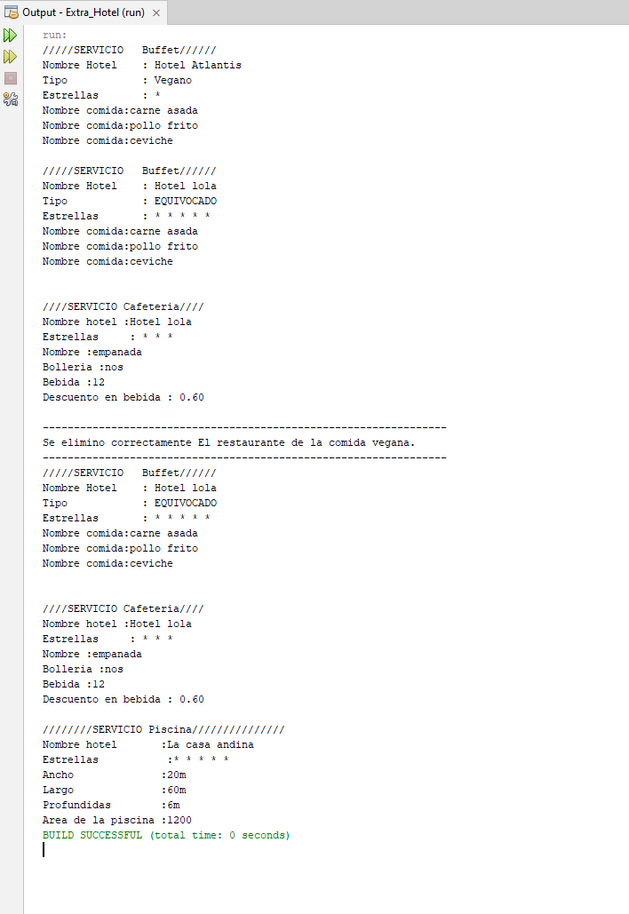

<h1>Servicio de Hosteleria</h1>

Se te encomienda realizar los servicios de la hosteleria 

<b>Servicio : </b>Se encarga de administrar una lista de comidas y una lista de piscinas.
Las tareas que deben cumplir son:

* agregar comida : Agrega  comida a la lista de comidas.
* agregar piscinas a lña lista : Agrega una piscina a la lista de piscinas.
* mostrar Piscina : Muestra los detalles de todas las piscinas en el servicio.
mostrar comida: Muestra los detalles de todas las comidas en el servicio.
* eliminar : Elimina el hotel con comida vegana de la lista de comidas.

<b>Hotel:</b> Representa un hotel con nombre y estrellas.
tareas que se deben realizar :
se comprobara que las estrellas esten en el rango de 1 al 5  en caso contrario se asignara 1 por defecto. tendremos un metodo imprimir.
tareas:
método que indica si la comida es vegana o no.
sobrescribir Método que imprime los detalles de la comida. Este método debe ser implementado en las clases que herede

<b>comida:</b>  Representa la comida en el hotel. 
Crea un constructor de comida con el nombre del hotel, el número de estrellas y el nombre de la comida.

cafeteria: Representa un servicio de cafeteria 
* bolleria: Indica si se ofrece bollería en la cafetería.
* precioBebidas: Precio de las bebidas en la cafetería.
* descuento: Descuento constante del 5% que se aplicará si la compra de bebidas supera los 10 euros.
tareas que deben realizar:
Implementar el método  para mostrar los detalles de la cafetería. Este método debe mostrar el nombre de la clase de servicio programáticamente, y las estrellas se representran con (*).
tambien mostrar si se aplica el descuento o no.

<b>buffet:</b>Representa un servicio de buffet. 
* tipoComida: Tipo de comida ofrecida en el buffet, que puede ser "vegano", "carnívoro" o "vegetariano". Si no se cumple ninguno de estos tipos, se guarda por defecto como "EQUIVOCADO".
* listaComidas: Lista de comidas disponibles en el buffet.
Las tareas que se deben realizar son:
* Verificar que el tipo de comida sea uno de los siguientes: "vegano", "carnívoro" o "vegetariano". Si no cumple con ninguno de estos tipos, se guarda por defecto como "EQUIVOCADO".
*Implementar el método imprimir() para mostrar los detalles del buffet. Este método debe mostrar el nombre del servicio programáticamente y la lista de comidas disponibles en el buffet. 

<b>comidaBuffet :</b>Subclase de Comida utilizada para representar los platos ofrecidos en un buffet.
Las tareas que deben realizar :
* Permite ingresar los nombres de los platos que se ofrecen en un buffet.

Será de mucha ayuda para gestionar los platos disponibles en el buffet desde el main. 

<b>piscina :</b>Representa una piscina con dimensiones de ancho, largo y profundidad.

* Al imprimir, muestra el nombre del servicio programáticamente, seguido de un símbolo (*) correspondiente al número de estrellas del hotel, seguido de los detalles de la piscina, incluyendo sus dimensiones (ancho, largo y profundidad) y su área total.

tendremos el ancho de la piscina el largo y la profundidad 
al imprimir  mostramos el nombre del servicio programaticamente las estrellas sera de este estilo(*) mostrar todos sus atributos  y su area total 

<b>Usar getters y setters si es necesario</b>

* Ejemplo de salida 

